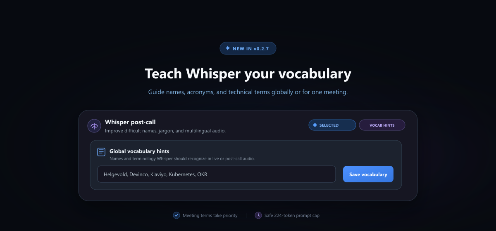

# Changelog

## 0.2.7 - 2026-08-23

  

### Critical Windows Upgrade Fix

Meetily `v0.2.6` could fail to launch after an upgrade from `v0.2.5` because
Windows builds embedded different line endings for one SQLx migration checksum.
`v0.2.7` recognizes only the two known checksums, verifies the exact people-table
and index definitions, repairs the recorded checksum, and preserves the existing
database.

If `v0.2.6` currently will not open, download and run the
[`v0.2.7` universal setup](https://github.com/TylerBuza/Meetily-ActuallyFree/releases/tag/v0.2.7)
manually. The in-app updater cannot run while `v0.2.6` is unable to launch. Do
not delete your Meetily data.

### Transcription Improvements

- Added independent live and post-call transcription defaults.
- Added global and meeting-specific Whisper vocabulary hints for names,
  acronyms, products, and technical terms.
- Carried vocabulary hints through live transcription, imports,
  retranscription, direct Whisper, and parallel processing paths.
- Prioritized meeting terms, deduplicated terms case-insensitively, and limited
  Whisper prompts to 224 tokens.
- Made model selection persistence-first and prevented overlapping preference
  saves.
- Hid the legacy Compact Parakeet model from new selections while retaining
  compatibility for existing installations.
- Added lighter navy-gray transcription panels and clearer selected-model
  states.
- Improved Whisper download-progress contrast and accessibility.

### Community Request

This release addresses the core request from the original Meetily project's
issue [Zackriya-Solutions/meetily#474](https://github.com/Zackriya-Solutions/meetily/issues/474):

> "Meeting Domain vocabulary hints for Whisper (initial_prompt)"

Global defaults now make recurring vocabulary available across meetings, while
meeting-specific terms take priority for specialized names and terminology.

### Windows Downloads

- `Meetily-ActuallyFree-0.2.7-x64-universal-setup.exe`: recommended installer;
  automatically selects CPU, Vulkan, or CUDA.
- `Meetily-ActuallyFree-0.2.7-x64-universal-updater.exe`: Tauri updater engine
  used by the in-app updater.
- `latest.json` and the matching `.sig`: updater metadata and cryptographic
  signature.
- `SHA256SUMS.txt`: SHA-256 checksums for release verification.

macOS remains on its separate qualification and release path.
