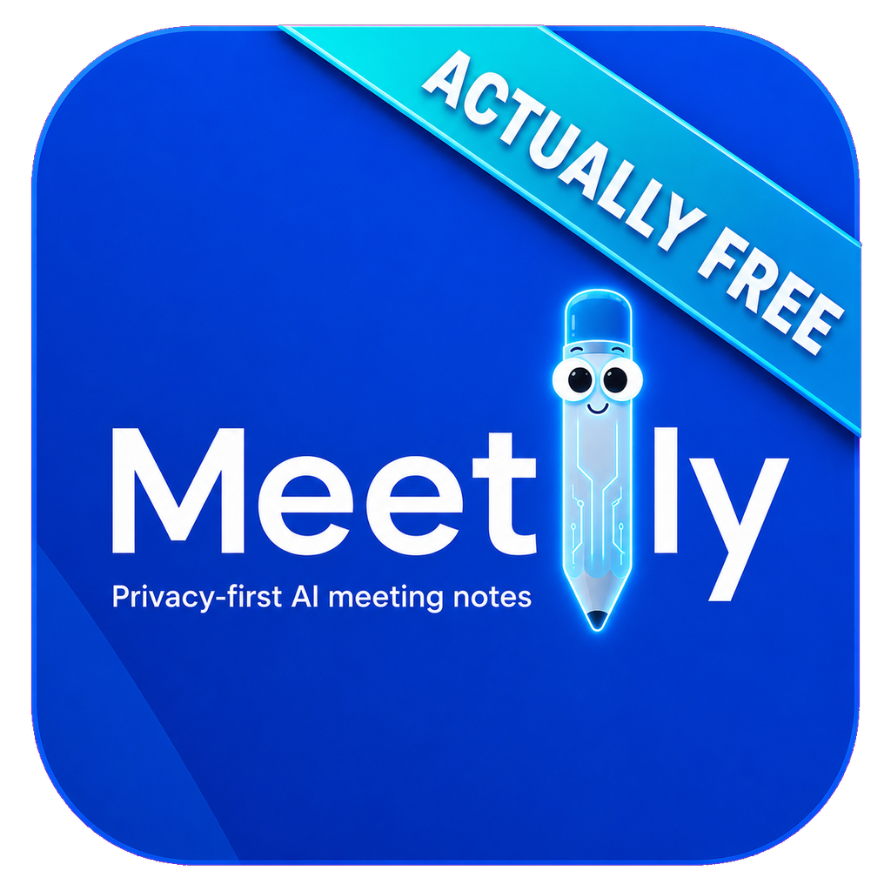

# Meetily - Actually Free

<p align="center">
  
</p>

An entirely free, fully unlocked fork of [Meetily](https://github.com/Zackriya-Solutions/meetily). Every feature is available without an account, subscription, license key, trial, or paid tier.

[Download for Windows](https://github.com/TylerBuza/Meetily-ActuallyFree/releases/latest) · [Download for macOS Apple Silicon](https://github.com/TylerBuza/Meetily-ActuallyFree/releases/tag/v0.2.5-macos)

This fork also goes beyond removing feature restrictions. It adds speaker identity, separate mic and system audio, automatic meeting detection, people profiles, richer exports, a redesigned interface, dedicated Windows and Apple Silicon installers, and numerous recording and reliability improvements.

## Feature Comparison

Compared with Meetily Community `v0.4.0` and the PRO advantages advertised on its project page (verified August 2026).

**Legend:** ✅ Included · ❌ Not included

| Feature | Meetily Community | Meetily PRO (Paywalled) | Meetily - Actually Free |
| --- | :---: | :---: | :---: |
| Live recording and local transcription | ✅ | ✅ | ✅ |
| Local and BYOK cloud summaries | ✅ | ✅ | ✅ |
| Create custom summary templates | ❌ | ✅ | ✅ |
| Automatic meeting joining | ❌ | ✅ | ❌ |
| Advanced PDF and DOCX exports | ❌ | ✅ | ✅ |
| Separate mic and system recordings | ❌ | ❌ | ✅ |
| Calendar integration | ❌ | ✅ | ❌ |
| Speaker identification | ❌ | ✅ | ✅ |
| Live mic and system audio visualizations | ❌ | ❌ | ✅ |
| Team self-hosted deployment | ❌ | ✅ | ❌ |
| Automatic meeting detection | ❌ | ✅ | ✅ |
| Floating recording controls | ❌ | ❌ | ✅ |
| Compliance audit trails | ❌ | ✅ | ❌ |
| Chat with meetings | ❌ | ✅ | ✅ |
| Speaker profiles | ❌ | ❌ | ✅ |
| Dark mode | ❌ | ❌ | ✅ |
| Windows GPU acceleration | ❌ | ✅ | ✅ |
| Automatic GPU setup | ❌ | ❌ | ✅ |
| No analytics transmission or license checks | ❌ | ❌ | ✅ |

## Highlights

- **Speaker-aware transcripts:** mic speech stays `You`; remote voices become `Speaker N`; overlap can render as `You + Speaker 1`.
- **Split audio pipeline:** microphone and system audio are VAD-processed and transcribed independently, while aligned source tracks are retained beside the mixed playback file.
- **Live source visualization:** separate mic and system meters show pre-mix activity throughout recording.
- **Floating recording bar:** shrink the main window into a compact minibar with a synchronized timer and pause, resume, stop, and restore controls.
- **Automatic meeting detection:** watches locally for Zoom, Teams, Slack, Webex, and other meeting apps, then prompts you to start recording.
- **Overhauled interface:** a cohesive dark-first theme across recording, transcripts, summaries, people, and settings, with light mode available.
- **Universal Windows setup:** one installer selects NVIDIA CUDA, Vulkan, or CPU and packages required runtimes.
- **Better post-call processing:** retranscribes retained mic/system tracks independently before diarization and summary.
- **Meeting memory:** global search, reusable people profiles, speaker naming, and grounded person Q&A.
- **Native exports:** PDF, DOCX, Markdown, text, JSON, or clipboard.
- **Resilient local models:** resumable, validated downloads with Parakeet mirror fallback.
- **Private updates and no telemetry:** Windows update checks are opt-in, and analytics transmission is disabled on every platform.

## Install

### Windows

1. Download `Meetily-ActuallyFree-*-universal-setup.exe` from the [latest release](https://github.com/TylerBuza/Meetily-ActuallyFree/releases/latest).
2. Run setup. It selects CUDA, Vulkan, or CPU automatically.
3. Complete first-launch model setup.

Windows 10/11 x64 is supported. The installer is unsigned, so SmartScreen may show **Unknown publisher**.

### macOS Apple Silicon

1. Download `Meetily-Actually-Free_0.2.5_aarch64.dmg` from the [macOS release](https://github.com/TylerBuza/Meetily-ActuallyFree/releases/tag/v0.2.5-macos).
2. Open the DMG and drag **Meetily - Actually Free** to Applications.
3. Grant microphone and screen/audio capture permissions when prompted.

M1 and newer Macs running macOS 13 Ventura or later are supported. The DMG is not Apple-notarized, so first launch may require Control-clicking the app and selecting **Open**. Both releases include SHA-256 checksums.

## Local Data

| Data | Location |
| --- | --- |
| Database, settings, and models | Install-local when writable; OS app-data fallback otherwise |
| Recordings | The user's `Music/meetily-recordings/<meeting>` folder |
| Playback and retained tracks | `audio.mp4`, `mic.mp4`, `system.mp4` |

## Build

<details>
<summary>Build instructions</summary>

Windows requirements: Rust, Node.js, pnpm, Visual Studio 2022 Build Tools with C++, CMake, and Git.

```powershell
cd frontend
pnpm install
pnpm run tauri:dev:cpu
```

Universal release build:

```powershell
cd frontend
.\scripts\build-universal-windows.ps1 -AllowUnsigned
```

Apple Silicon DMG build on macOS 13 or later:

```bash
cd frontend
pnpm install
./scripts/build-macos-apple-silicon.sh
```

See [`ARCHITECTURE.md`](ARCHITECTURE.md) for implementation and release details.

</details>

## Credits And License

Maintained by [Tyler Buza](https://buza.dev). Based on the original [Meetily](https://github.com/Zackriya-Solutions/meetily) project by Zackriya Solutions.

MIT licensed. See [`LICENSE.md`](LICENSE.md). Original copyright notices and license terms are retained.
