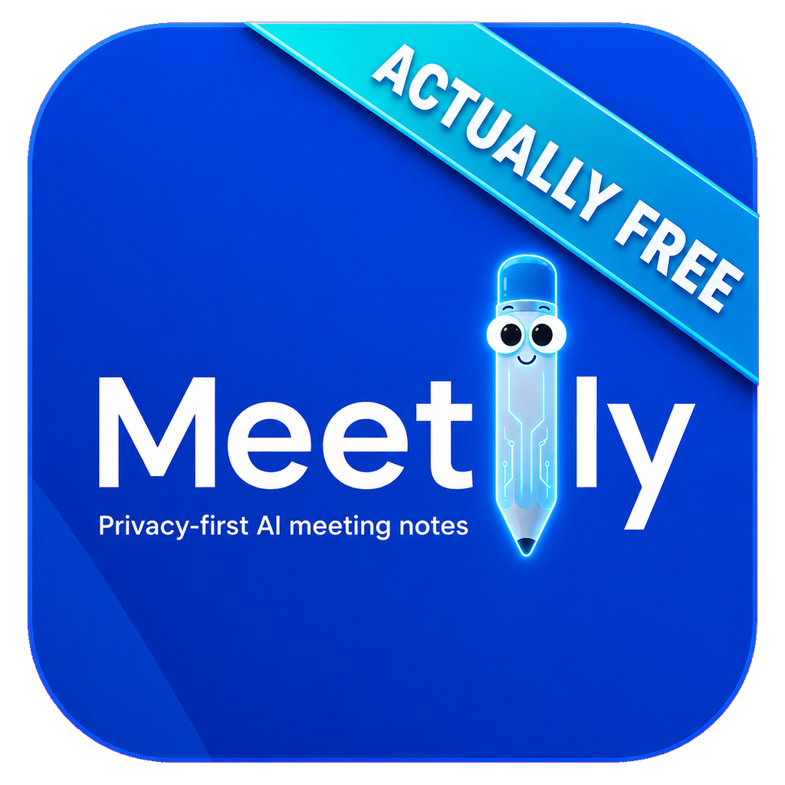
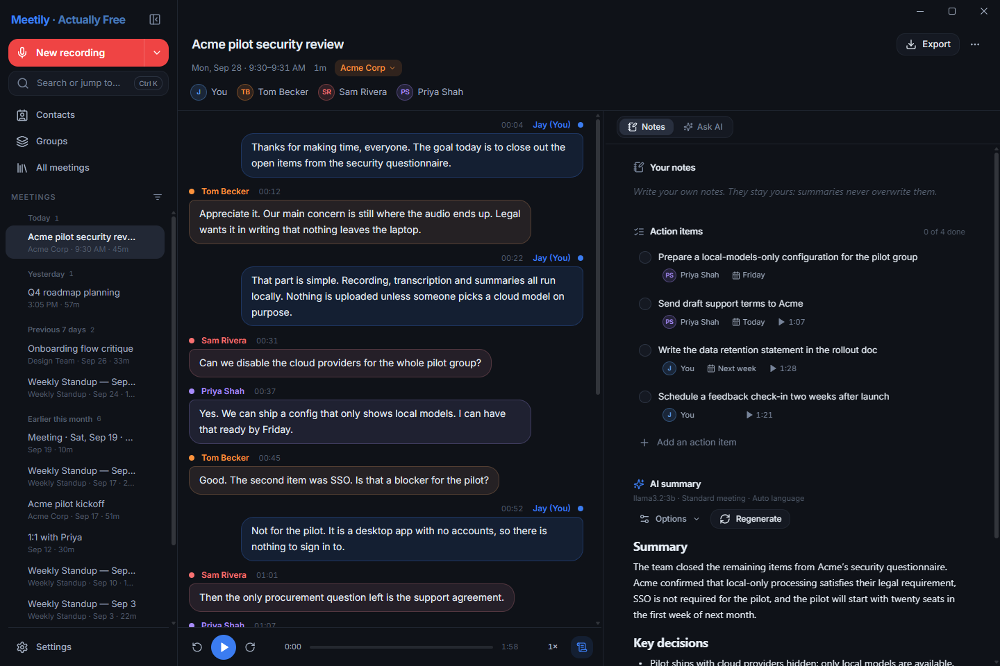
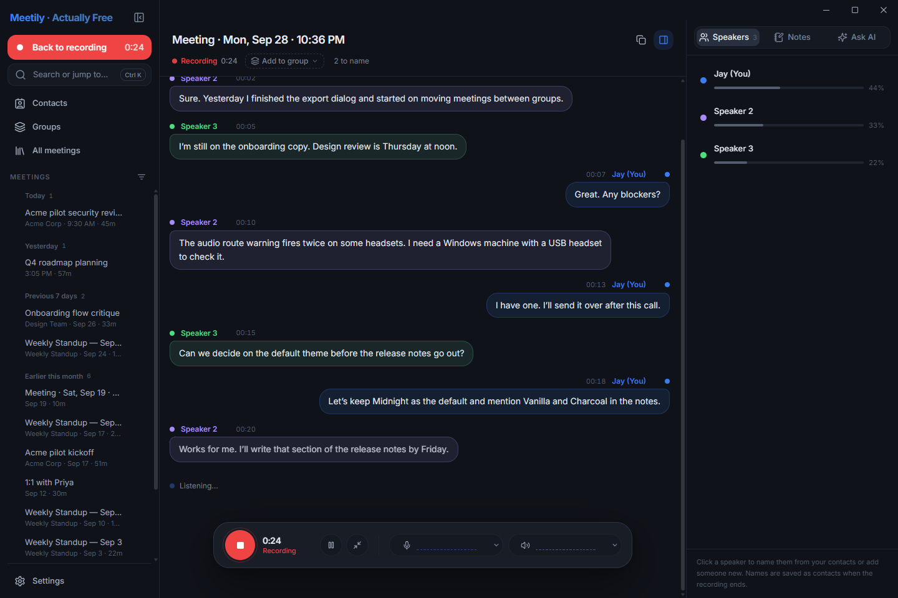

# Meetily - Actually Free

<p align="center">
  
</p>

**Record a meeting. Follow the conversation. Turn it into useful notes.**

A free, local-first meeting recorder and workspace, built on
[Meetily](https://github.com/Zackriya-Solutions/meetily). This fork unlocks the app's
features without an account, license key, trial, or paid app tier—and adds live
speaker editing, per-app capture, a redesigned interface, and more.

[Download Windows](https://github.com/TylerBuza/Meetily-ActuallyFree/releases/latest)
· [macOS Apple Silicon preview](https://github.com/TylerBuza/Meetily-ActuallyFree/releases/tag/v0.2.5-macos)
· [What's new in v0.2.18](docs/RELEASE_V0218.md)
· [Report an issue](https://github.com/TylerBuza/Meetily-ActuallyFree/issues)

## A redesigned Meetily

**v0.2.18 brings a major UI overhaul:** a rebuilt recording experience, meeting
workspace, navigation, shared components, and three themes—Midnight, Vanilla,
and Charcoal. The existing React/Next.js interface has been extensively reworked,
with supporting workspace and native/backend changes.

The screenshots and feature overview below show **current main / the upcoming
v0.2.18 release**. Screenshots use demo meetings and simulated recording.

### Transcript, notes, action items, and summary in one workspace

<p align="center">
  
</p>

<details>
<summary><strong>See the live recording screen and meeting library</strong></summary>

### Live recording

<p align="center">
  
</p>

### Meeting library

<p align="center">
  
</p>

</details>

## What you can do

### Record and transcribe locally

- Capture microphone and computer audio with separate mute, volume, and level
  controls. Keep using the workspace during a call, or shrink to the floating
  recording bar.
- Transcribe live with **Parakeet** or a configured transcription engine. Use
  **Whisper** for optional post-call enhancement independently of the live model.
- Retain microphone and system tracks alongside mixed playback audio, so
  overlapping sources can be processed separately.
- Choose specific applications instead of all computer audio: Windows supports
  a multi-app whitelist; macOS currently supports one selected application.
- Use Whisper vocabulary hints for recurring names, acronyms, and meeting terms.

### Follow and identify speakers

- Keep microphone speech identified as **You**, with remote speakers labeled
  separately. Rename and merge speakers during a call and edit labels afterward.
- Choose optional **Nemotron-3** for live remote-speaker labeling and post-call
  refinement. Nemotron uses **Auto-detect**; model speaker numbers are not a
  person's identity.
- Associate named speakers with contacts and see consistent person colors across
  transcripts and meeting pages.

### Work with your meetings

- Read a speaker-colored, chat-style transcript and jump to audio from a line's
  timestamp. Keep notes, action items, and the AI summary beside the conversation.
- Organize meetings into groups, browse contacts and their meetings, and track
  action items with owners and due dates.
- Search meetings, transcripts, summaries, groups, people, and action items from
  the **Ctrl+K command bar**.
- Export one or multiple meetings to **PDF, Word, Markdown, text, or JSON**.

### Choose how AI runs

- Use local summary models or connect a supported provider with your own API key.
- Use the **Claude Code CLI** summary provider with your installed `claude`
  command and existing sign-in. External providers retain their own access and
  billing requirements; the app adds no subscription requirement.
- Ask questions about meetings and use custom summary templates.
- Download optional models in the background during setup. Nemotron enables
  after a successful download; optional Whisper is configured for post-call use.

### Explore optional Labs features

Settings → **Labs** contains opt-in, experimental capabilities:

- **Meeting automation:** on supported Windows meeting-detection signals,
  automatically start and stop recordings owned by the automation.
- **Waveform scrubbing:** navigate audio visually, with additional slower
  playback speeds.
- **Clean transcript:** switch between Clean and Verbatim views and use cleaned
  text for new summaries.
- **Whisper silence guard:** stricter silence/noise handling for Whisper.
- **Parakeet GPU:** run the encoder through DirectML on Windows.
- **Voice profiles:** learn a contact's voice from their recorded meetings and
  use voice matching in later meetings. Matching is experimental.

## Also improved in v0.2.18

- Preserve continuous audio across jittered capture callbacks, addressing the
  recording buzz/clicks reported in [#40](https://github.com/TylerBuza/Meetily-ActuallyFree/issues/40).
  The correction applies to new recordings; existing damaged audio is not repaired.
- Retain the beginning of detected utterances and improve live system-audio
  speech sensitivity.
- Restore AI-generated titles for automatically named meetings while respecting
  manual titles.
- Keep the meeting interactive during post-call processing, with progress in a
  compact bottom card and a centered **Auto-detect & continue** speaker prompt.
- Show a **Low audio** advisory for quiet system input; gain stays under your
  control.
- Improve capture-start errors, setup checks, and recovery of live speaker edits.

See the [full release notes](docs/RELEASE_V0218.md) and [changelog](CHANGELOG.md).

## Download and setup

**Release availability:** the latest published Windows release is **v0.2.17**.
**v0.2.18 is prepared as a draft**, with its new interface shown above. The
separate Apple Silicon download remains **v0.2.5-macos** and does not contain all
the features on current main.

### Windows

1. Download `Meetily-ActuallyFree-*-universal-setup.exe` from the
   [latest published release](https://github.com/TylerBuza/Meetily-ActuallyFree/releases/latest).
2. Run setup. The universal installer chooses **NVIDIA CUDA, Vulkan, or CPU** and
   includes the required runtimes.
3. Complete first-launch model setup and select your microphone/audio source.
   Optional downloads can continue in the background; recording needs a ready
   transcription model.

Windows 10/11 x64 is supported. Windows installers are not Authenticode-signed,
so SmartScreen may show **Unknown publisher**. Release downloads include SHA-256
checksums; the Windows updater payload has a separate cryptographic signature.

### macOS Apple Silicon preview

1. Download `Meetily-Actually-Free_0.2.5_aarch64.dmg` from the
   [macOS release](https://github.com/TylerBuza/Meetily-ActuallyFree/releases/tag/v0.2.5-macos).
2. Open the DMG and drag **Meetily - Actually Free** into Applications.
3. Grant microphone and Audio Capture permissions when prompted.

Requires an **M1 or newer Mac running macOS 14.2 Sonoma or later**. The DMG is
not notarized; first launch may require Control-click → **Open**. This separate
preview passed automated packaging/launch checks, with physical macOS capture
qualification still pending. See the [macOS release runbook](.github/workflows/MACOS_RELEASE.md).

## Your data and model choices

Recordings, the meeting database, and downloaded models are stored locally.
Local inference can run without sending meeting content to a cloud model;
choosing a cloud provider or Claude CLI changes where that provider processes
the content. Model downloads and optional update checks require network access.
Analytics transmission is disabled, and Windows update checks are opt-in.

| Data | Location |
| --- | --- |
| Database, templates, and models | Windows/Linux: `<app folder>/data` when writable, with an OS data-directory fallback; macOS: `~/Library/Application Support/Meetily` |
| Recording/onboarding preferences | Tauri's application-data store; macOS: `~/Library/Application Support/com.meetily.ai` |
| Default recordings folder | Windows: `Music/meetily-recordings`; macOS: `Movies/meetily-recordings` |
| Saved audio tracks | `audio.mp4` (mixed playback), `mic.mp4`, and `system.mp4` |

Change the recordings folder in **Settings → Recording → Save Location**.
The meeting database, models, and preferences are distinct from the audio folder;
copying recordings alone does not move the entire workspace.

## Build and contribute

The desktop app uses **React/Next.js** in a **Tauri 2** WebView. **Rust** owns
capture, transcription, diarization, local storage, and AI orchestration. No
separate application server is required.

Start with the [development map](docs/DEVELOPMENT_MAP.md),
[architecture notes](ARCHITECTURE.md), and [contributor conventions](AGENTS.md).
The map links subsystem ownership, targeted tests, and qualification notes.

<details>
<summary><strong>Build commands</strong></summary>

Windows prerequisites: Rust, Node.js/pnpm, Visual Studio 2022 Build Tools with
C++, CMake, and LLVM/libclang. GPU builds also need the corresponding SDK/toolkit.

```powershell
cd frontend
pnpm install
pnpm run tauri:dev:cpu
```

Universal Windows packaging:

```powershell
cd frontend
.\scripts\build-universal-windows.ps1 -AllowUnsigned
```

Validate the resulting Windows package from the repository root:

```powershell
node frontend/scripts/verify-windows-release.mjs
```

Apple Silicon builds must run on macOS with Rust, Node.js/pnpm, and Xcode command
line tools:

```bash
cd frontend
pnpm install
./scripts/build-macos-apple-silicon.sh
```

</details>

## Thank you to the contributors

This update is a community effort. In particular:

- **[@jayjoe101](https://github.com/jayjoe101)** — the extensive UI/workspace
  overhaul and integration in [#39](https://github.com/TylerBuza/Meetily-ActuallyFree/pull/39).
- **[@ampersandru](https://github.com/ampersandru)** — live speaker editing
  ([#36](https://github.com/TylerBuza/Meetily-ActuallyFree/pull/36)), per-app capture
  ([#37](https://github.com/TylerBuza/Meetily-ActuallyFree/pull/37)), combined features
  and Labs ([#38](https://github.com/TylerBuza/Meetily-ActuallyFree/pull/38)), and the
  original Nemotron contribution ([#34](https://github.com/TylerBuza/Meetily-ActuallyFree/pull/34)).
- **[@cedstrom](https://github.com/cedstrom)**, with original commits attributed
  to **[@chris-edstrom](https://github.com/chris-edstrom)** — Claude Code CLI
  summaries in [#28](https://github.com/TylerBuza/Meetily-ActuallyFree/pull/28).
- **[@fernandog](https://github.com/fernandog)** — the detailed recording-artifact
  investigation in [#40](https://github.com/TylerBuza/Meetily-ActuallyFree/issues/40).

PRs bundled into another PR retain their original authors' credit. Read the
[expanded acknowledgments](docs/RELEASE_V0218.md#a-huge-thank-you-to-our-contributors)
for their individual contributions. Thank you to everyone testing builds,
reporting bugs, and contributing improvements.

Maintained by [Tyler Buza](https://buza.dev), based on the original
[Meetily](https://github.com/Zackriya-Solutions/meetily) project by Zackriya Solutions.
Credit also belongs to the open-source model and runtime projects used by the app,
including Enes Altun's MIT-licensed `parakeet-rs` Sortformer implementation.

MIT licensed. See [LICENSE.md](LICENSE.md). Original copyright notices and license
terms are retained.
